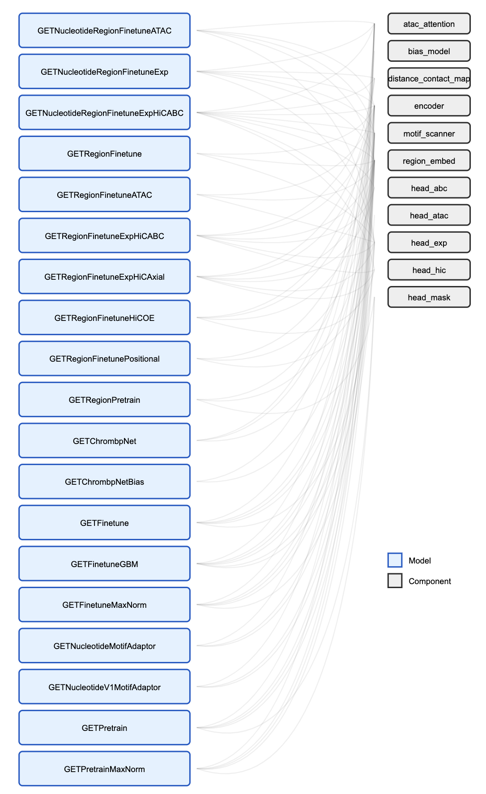

# GET: Gene Expression Transformer

GET: a foundation model of transcription across human cell types

## Table of Contents

- [GET: Gene Expression Transformer](#get-gene-expression-transformer)
  - [Table of Contents](#table-of-contents)
  - [Installation](#installation)
  - [Quick Start](#quick-start)
  - [Model Architecture](#model-architecture)
  - [Training](#training)
  - [Evaluation](#evaluation)
  - [Configuration](#configuration)
  - [Contributing](#contributing)
  - [License](#license)
  - [Citation](#citation)
  - [Contact](#contact)

## Installation
Checkout scripts/setup_env.sh to setup the environment.

```bash
bash scripts/setup_env.sh /path/to/project/root
```

## Quick Start

We provide a tutorial on how to prepare the data, finetune the model, and do interpretation analysis [here](tutorials/full_v1_pipeline.py).

To run a basic training job in command line:
```bash
python get_model/debug/debug_run_region.py --config-name finetune_tutorial stage=fit
```

## Model Architecture

GET uses a transformer-based architecture with several key components:
- Region Embedding
- Motif Scanner
- ATAC Attention
- Transformer Encoder
- Task-specific heads (Expression, Hi-C, etc.)


[](model.html)

Click on the image above to view an interactive diagram of the model architecture.


For more details on how you can write new models, see [Model Architecture](tutorials/Model%20Customization.md).

## Training

To fine-tune a pre-trained model:

See [Fine-tuning Tutorial](tutorials/Finetune.md) for more information.

## Evaluation

To evaluate a trained model:
```bash
python get_model/debug/debug_run_region.py --config-name finetune_tutorial stage=validate
```

## Configuration

GET uses Hydra for configuration management. Key configuration files:

- Base config: `get_model/config/config.py`
- Model configs: `get_model/config/model/*.yaml`
- Dataset configs: `get_model/config/dataset/*.yaml`

See [Configuration Guide](tutorials/Configuration.md) for more details.

## Contributing

We welcome contributions! Please see our [Contributing Guidelines](CONTRIBUTING.md) for more information.

## License

This project is licensed under the CC BY-NC 4.0 License.

## Citation

If you use GET in your research, please cite our paper:

## Contact

For questions or support, please open an issue or contact [fuxialexander@gmail.com](mailto:fuxialexander@gmail.com).
